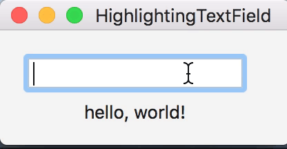

# EJVHighlightingTextField

An NSTextField subclass that supports highlighting the portion of its contents that matches a search string.

## Example

## Usage

`EJVHighlightingTextField` has the following three properties:

    // Key-value observable, bindable
    @property (nullable, nonatomic, strong) NSString *searchString;

    // Defaults to yellow
    @property (nonatomic, strong) NSColor *matchesHighlightColor;

    // Applied when the text field's cell has a background style of NSBackgroundStyleDark. Defaults to whitish
    @property (nonatomic, strong) NSColor *matchesHighlightColorForHighlightedBackground;

    // Default value: NO
    @property (nonatomic) BOOL underlineMatches;

The `searchString` property determines the text to look for and highlight in the text field. It can be bound to, for example, another text field's content:

    [self.searchField bind:NSValueBinding
                  toObject:self.highlightingTextField
               withKeyPath:@"searchString"
                   options:@{ NSContinuouslyUpdatesValueBindingOption: @YES }];
